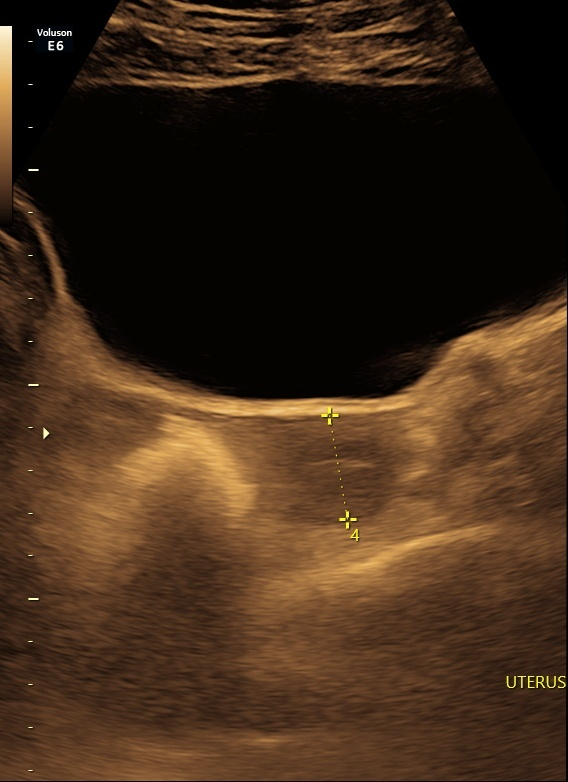
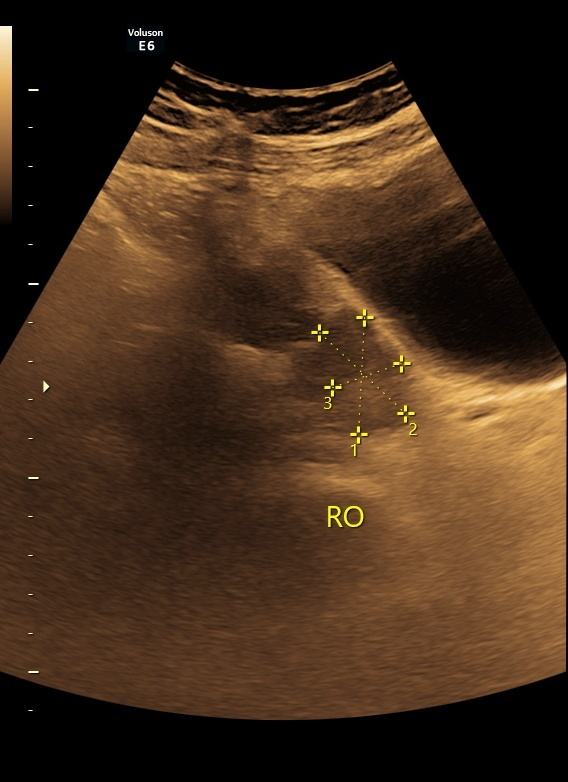

## Attention Enhanced Perceptual Image Anomaly Detection for Ultrasound Imagery

## Key Features
- Perceptual Autoencoders  
- Semi-supervised learning  
- Anomaly detection  
- Ultrasound imagery  

## Abstract
This project proposes a novel model, SEPIAD, integrating the Squeeze-and-Excitation (SE) attention block into the architecture of the Perceptual Image Anomaly Detection model (PIAD). The dataset used consisted of 2,813 images (2,014 normal and 799 abnormal) of abdominal organs, curated from 242 patients at MH Samorita Hospital and Medical College, Dhaka, Bangladesh.

PIAD leverages adversarial and perceptual losses trained solely on normal images. To enhance this framework, we propose SEPIAD, a lightweight architecture that employs SE blocks to emphasize important feature channels, improving anomaly detection in ultrasound imagery without increasing model complexity.

After training, SEPIAD calculates abnormality as the perceptual dissimilarity between the input image and the closest generated image of the modeled data distribution. SEPIAD outperformed the PIAD baseline, achieving a ROC AUC of 0.95 — at least 8% higher than PIAD — demonstrating its effectiveness in ultrasound image analysis, which is inherently noisy, low-contrast, and difficult to interpret due to subtle organ boundaries.

## Dataset
- Custom curated ultrasound dataset  
- Not publicly available due to privacy and sensitivity concerns  
 

## Motivation
Semi-supervised or unsupervised deep learning in medical imaging is gaining momentum due to the lack of large, well-annotated datasets. Among imaging modalities such as X-rays, CT, MRI, Ultrasound (US), and CR, ultrasound is particularly challenging because of its noisy texture, low contrast, and subtle anatomical boundaries.

The original PIAD model was tested on datasets like MNIST, CIFAR-10, Fashion-MNIST, COIL-100, LSUN, and CelebA. While PIAD provides a solid baseline, it often fails to capture the nuanced variations necessary for reliable detection in ultrasound data.

To address this, we introduce SEPIAD, which augments PIAD with SE attention, enabling the model to focus on the most informative feature channels. The aim is straightforward but critical: deliver a lightweight, accurate, and clinically meaningful anomaly detection system to better assist radiologists in real-world ultrasound analysis.

## Dataset Structure:
```
├── us                    
│   ├── healthy_only_2014
      ├── 1.jpg
      ├── 2.jpg
      ├── 3.jpg.....
    ├── train_fif_list_1800.txt
    ├── val_fif_list_214.txt

├── us
|   ├── images
           ├── 1.jpg
           ├── 2.jpg
           ├── 3.jpg.....                   
      ├── test_normal_2014.txt
      ├── test_abnormal_799.txt             
  ```


## Dataset Summary

| Category   | Subset     | Count | Total |
|------------|------------|-------|-------|
| Healthy    | Train      | 1800  | 2014  |
|            | Validation | 214   |       |
| Unhealthy  | Test       | 799   | 799   |


## Sample Images from the Dataset:

##  Sample Ultrasound Images

<p align="center">
  
  
  
</p>

<p align="center">
  
  
</p>

## Architecture
 <p align="center">
  
</p>

### Results
ROC curve 1 and PR curve 2 show the impacts of SE block in the architecture. ROC curve 2 and PR1 show the baseline model's persormance.
| ROC Curve 1 | ROC Curve 2 |
|-------------|-------------|
| [ROC1](Results/roc1-2.pdf) | [ROC2](Results/roc2-2.pdf) |

| PR Curve 1  | PR Curve 2  |
|-------------|-------------|
| [PR1](Results/recall1-2.pdf) | [PR2](Results/recall2-2.pdf) |


# Project Structure
```
├── Results                     
│   ├── git1.png
    ├── roc1.pdf
    ├── roc2.pdf
    ├── recall1.pdf
    ├── recall2.pdf
├── codes
|   ├── pg_decoders.py                      
    ├── pg_encoders.py                
    ├── evaluate.py         
    ├── latent_dis.py             
    ├── latent_model.py         
    ├── optimizer.py                
    ├── train.py   
    ├── utils.py              
    ├── Attn_models.py               
    ├── layers.py               
    ├── pg_networks.py
    ├── dataset.py
    ├── transforms.py
    ├── loggers.py          
    └── .gitignore                   
    ├── README.md
├── config
    ├── eval_example.yaml
    ├── train_example.yaml          
├── requirements.txt                      
  ```

## Installation

Clone the repository and install the dependencies.

```bash
# Clone this repo
git clone https://github.com/sifat1992/SEPIAD.git
cd SEPIAD

# Install dependencies
pip install -r requirements.txt
```

## References
1. Nina Tuluptceva, Bart Bakker, Irina Fedulova, Anton Konushin
   “PERCEPTUAL IMAGE ANOMALY DETECTION.” [arXiv:1909.05904](https://arxiv.org/pdf/1909.05904) 


## Author
- **Sifat Z. Karim** — Graduate Student, Mississippi State University  
  📧 [sifatzinakarim1992@gmail.com](mailto:sifatzinakarim1992@gmail.com)  
  🧑‍💻 GitHub: [@sifat1992](https://github.com/sifat1992)

## Contact

For questions, suggestions, or collaboration opportunities, feel free to reach out!  
I’m happy to receive feedback and open to connecting with fellow researchers.

## License
This project is licensed under the [MIT License](LICENSE).


---


