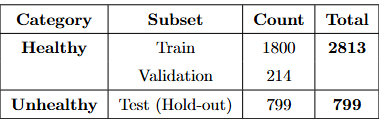

#Attention Enhanced Perceptual Image Anomaly Detection for Ultrasound Imagery

# Key features
> Perceptual Autoencoders
> Semi-supervised learning
> Anomaly detection
> Ultrasound Imagery

#Abstract
This project proposes a novel model, SEPIAD, with an integration of the Squeeze and Excitation attention block into the architecture of the Perceptual Image Anomaly Detection model, PIAD. The dataset used in this work consisted of 2813 images, with 2014 normal and 799 abnormal images of abdominal organs, curated from 242 patients at MH Samorita Hospital and Medical College in Dhaka, Bangladesh. Perceptual Image anomaly Detection (PIAD) leverages adversarial losses and perceptual losses trained solely on normal images. To enhancethis framework, we have proposed a lightweight architecture, SEPIAD, using the Squeeze and Excitation (SE) blocks to focus more on the important feature channels, enhancing anomaly detection on ultrasound images without raising the model complexity. After training, the proposed model, SEPIAD, calculates the abnormality of the input image as the perceptual dissimilarity between it and the closest generated image of the modeled data distribution. SEPIAD outperformed the baseline model, PIAD, achieving a Receiver Operating Characteristic Area Under the Curve (ROC AUC) of 0.95, outperforming the baseline model by at least 8%, proving the model’s effectiveness in Ultrasound image analysis, which has an inherently noisy structure, low contrast, and subtle organ boundaries.

# Dataset
> Custom curated Ultrasound dataset.
> Not publicly available due to sensitivity and privacy constraints.
> Contact for access if needed for research colloboration.

# Motivation
Seme-supervised or unsupervised deep learning in medical image processing is getting more attention due to the lack of availability of large and properly annotated datasets. Among various modalities, namely X-rays, Computed Tomography (CT) Scan,
Magnetic Resonance Imaging (MRI), Ultrasound (US), Computed Radiography (CR), etc., US images are often the most challenging to work with due to their inherently noisy structure, low contrast, and subtle organ boundaries. It is often hard to process the Us images. The original PIAd model was tested on MNIST and CIFAR-10, fMNIST and COIL-100, LSUN, and CelebA dataset. PIAD provide a solid baseline for the US images but often fail to capture the nuanced variations needed for reliable detection. To address this gap, we introduce SEPIAD, which enhances PIAD with Squeeze-and-Excitation attention, enabling the model to prioritize the most informative feature channels. The goal is simple but critical: deliver a lightweight, accurate, and clinically meaningful anomaly detection system that can better assist radiologists in real-world ultrasound analysis.

### Dataset Breakdown

<p align="center">
  
</p>

### Results
ROC curve 1 and PR curve 2 show the impacts of SE block in the architecture. ROC curve 2 and PR1 show the baseline model's persormance.
| ROC Curve 1 | ROC Curve 2 |
|-------------|-------------|
| [ROC1](Results/roc1-2.pdf) | [ROC2](Results/roc2-2.pdf) |

| PR Curve 1  | PR Curve 2  |
|-------------|-------------|
| [PR1](Results/recall1-2.pdf) | [PR2](Results/recall2-2.pdf) |


# Project sturcture
```
├── Results                     
│   ├── git1.png
    ├── roc1.pdf
    ├── roc2.pdf
    ├── recall1.pdf
    ├── recall2.pdf
├── codes
|   ├── pg_decoders.py                      
    ├── pg_encoders.py                
    ├── evaluate.py         
    ├── latent_dis.py             
    ├── latent_model.py         
    ├── optimizer.py                
    ├── train.py   
    ├── utils.py              
    ├── Attn_models.py               
    ├── layers.py               
    ├── pg_networks.py
    ├── eval_example.yaml
    ├── train_example.yaml               
    └── .gitignore                   
    ├── README.md                       
  ```
#References
1. Nina Tuluptceva, Bart Bakker, Irina Fedulova, Anton Konushin
   “PERCEPTUAL IMAGE ANOMALY DETECTION.” [arXiv:1909.05904](https://arxiv.org/pdf/1909.05904) 


# Author
- **Sifat Z. Karim** — Graduate Student, Mississippi State University  
  📧 [sifatzinakarim1992@gmail.com](mailto:sifatzinakarim1992@gmail.com)  
  🧑‍💻 GitHub: [@sifat1992](https://github.com/sifat1992)

## Contact

For questions, suggestions, or collaboration opportunities, feel free to reach out!  
I’m happy to receive feedback and open to connecting with fellow researchers.


---

